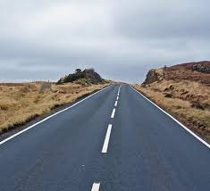
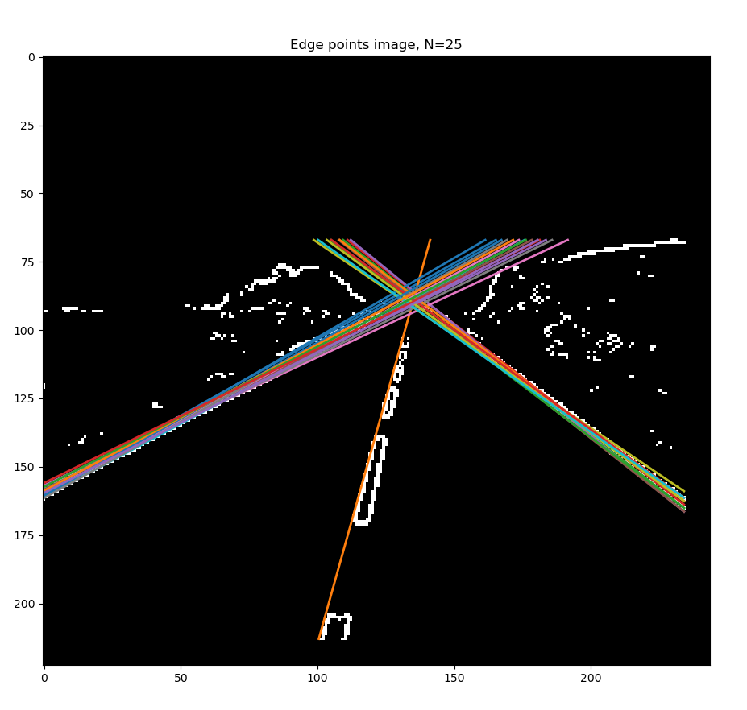
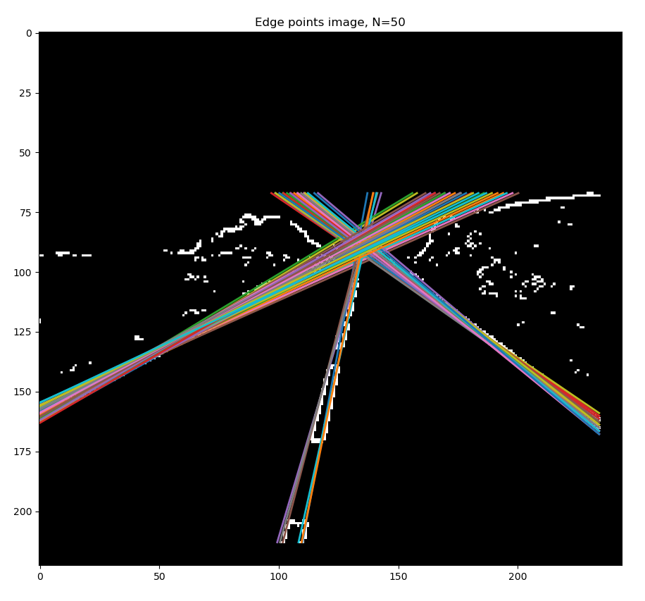
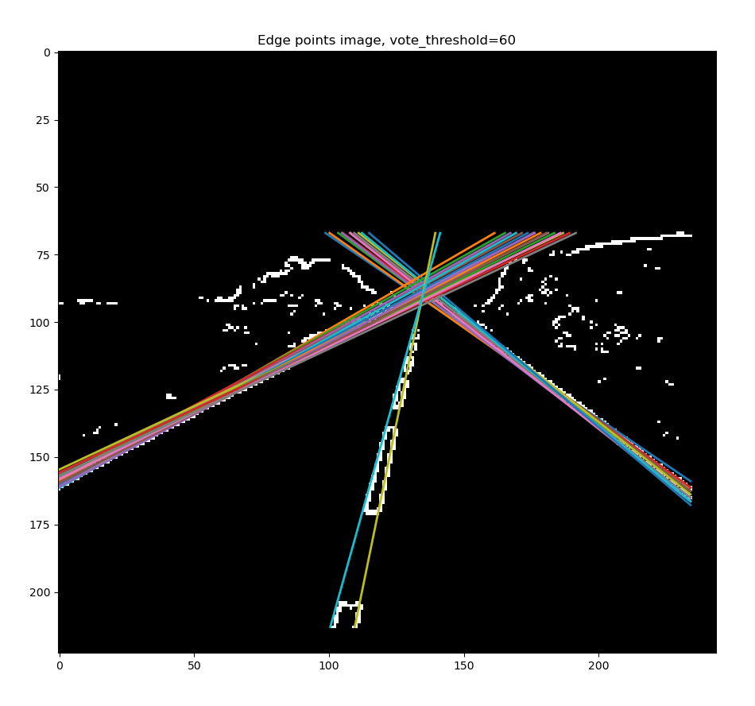
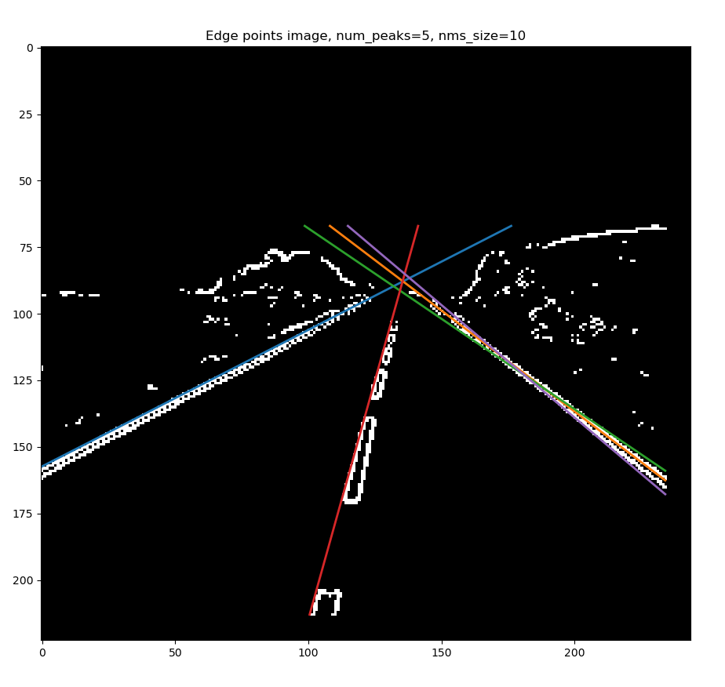
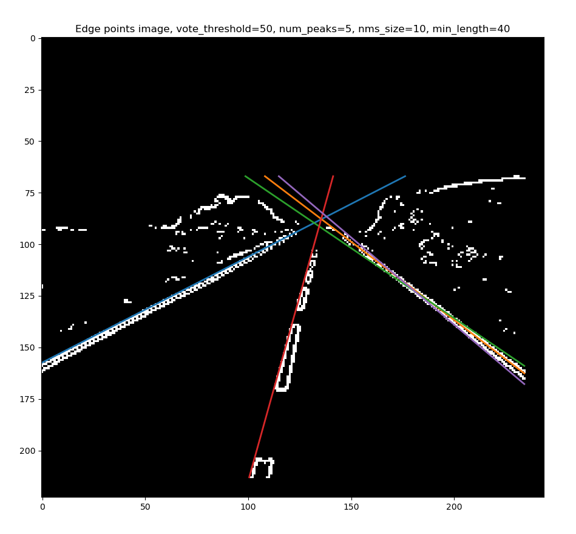

# hough_learning

### First attempt at multi-line detection using the hough transform, N number of lines

### Second attempt at multi-line detection, using a threshold instead of N

### Third attempt, enforcing unique lines

### Fourth attempt, this uses the previous techniques as well as a minimum line length

